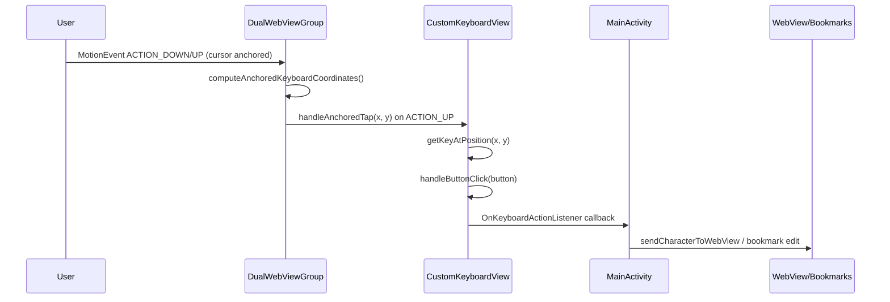

# Input Systems

TapLink exposes three complementary input modes:

- **Anchored mode**: The keyboard is fixed in the viewport and taps are redirected based on the cursor location. Drag and fling listeners are suppressed so only discrete taps are processed. 【F:app/src/main/java/com/TapLink/app/DualWebViewGroup.kt†L1592-L1774】【F:app/src/main/java/com/TapLink/app/CustomKeyboardView.kt†L173-L260】【F:app/src/main/java/com/TapLink/app/CustomKeyboardView.kt†L648-L716】
- **Free (focus) mode**: The keyboard is navigated via horizontal drags and flings that move the focus highlight before triggering `performFocusedTap()`. 【F:app/src/main/java/com/TapLink/app/DualWebViewGroup.kt†L1650-L1664】【F:app/src/main/java/com/TapLink/app/DualWebViewGroup.kt†L1785-L1803】【F:app/src/main/java/com/TapLink/app/CustomKeyboardView.kt†L648-L716】
- **Voice Control**: High-accuracy speech-to-text powered by the Groq API. Activate it by pressing the microphone key on the custom keyboard. An API key is required and can be entered via the settings menu. 【F:app/src/main/java/com/TapLink/app/GroqAudioService.kt】【F:app/src/main/java/com/TapLink/app/MainActivity.kt†L3740-L3845】

## Mouse tap mode

TapLink also supports a pointer-driven mouse tap mode for wearable mouse devices such as Mudra:

- Input from device names containing `Mudra` auto-enables mouse tap mode.
- Input from `cyttsp5_mt` auto-disables mouse tap mode and restores cursor mode.
- While active, TapLink hides the visual cursor and routes pointer hover/click through custom control hit-testing.
- Right-eye pointer coordinates are translated onto the left-eye interaction plane for consistent targeting.
- Press-drag-release over web content is converted into touch-style swipe scroll, and drag release is consumed to avoid accidental link activation.

## Anchored tap pipeline

In anchored mode, drag and fling routines (`handleDrag`, `handleFlingEvent`) bail early so only the anchored tap path fires. Once `handleAnchoredTap` identifies the target key it forwards to `handleButtonClick`, which emits callbacks such as `onKeyPressed`, `onEnterPressed`, or `onHideKeyboard`. `MainActivity` routes those callbacks to the active destination—either the inline URL editor, bookmark panel, or the `WebView`. 【F:app/src/main/java/com/TapLink/app/DualWebViewGroup.kt†L1592-L1774】【F:app/src/main/java/com/TapLink/app/CustomKeyboardView.kt†L173-L260】【F:app/src/main/java/com/TapLink/app/MainActivity.kt†L3848-L3940】

## Focus-driven tap pipeline

When the keyboard is unanchored, `DualWebViewGroup` ignores anchored interception and instead forwards drag events to `CustomKeyboardView.handleDrag`, which advances the highlighted key. A tap (`ACTION_UP`) invokes `performFocusedTap()` so the currently focused button emits callbacks without cursor remapping. 【F:app/src/main/java/com/TapLink/app/DualWebViewGroup.kt†L1650-L1664】【F:app/src/main/java/com/TapLink/app/DualWebViewGroup.kt†L1785-L1803】【F:app/src/main/java/com/TapLink/app/CustomKeyboardView.kt†L648-L716】

For a deeper dive into anchored input handling, see [Anchored Keyboard Mode](anchored-mode.md).
